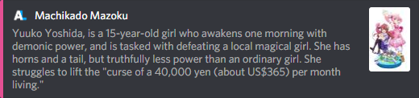
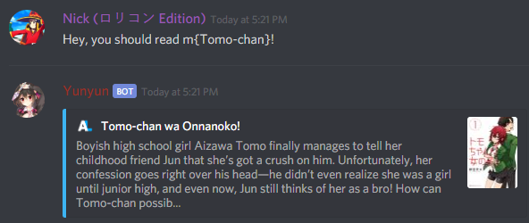

# AniLinker

A Discord bot that uses the [AniList](https://anilist.co) API to retrieve and display information about Anime and Manga.



## Running Locally

Make sure you have [Node.js](https://nodejs.org/) installed.

Run these commands to get the project locally:

```sh
git clone https://github.com/TehNut/AniLinker.git # or clone your own fork
cd AniLinker
npm install
```

Create a new `config.json` file in the root directory of the project (the same directory as this README) with the following properties:

```json
{
  "token": "$TOKEN"
}
```

`$TOKEN` should be the bot token obtained from [Discord's developer panel](https://discordapp.com/developers/).

Finally, run `npm start` to start the bot.

## Commands

Commands are designed in a way that allows them to be used in the middle of a normal message. 
Simply wrap the name of an anime or manga in `{}` and prefix that with a command name.

eg: a{machikado mazoku} will search for the Machikado Mazoku anime.

To search for anime, use `a` or `anime` as your prefix. To search for manga, use `m` or `manga` as your prefix.

